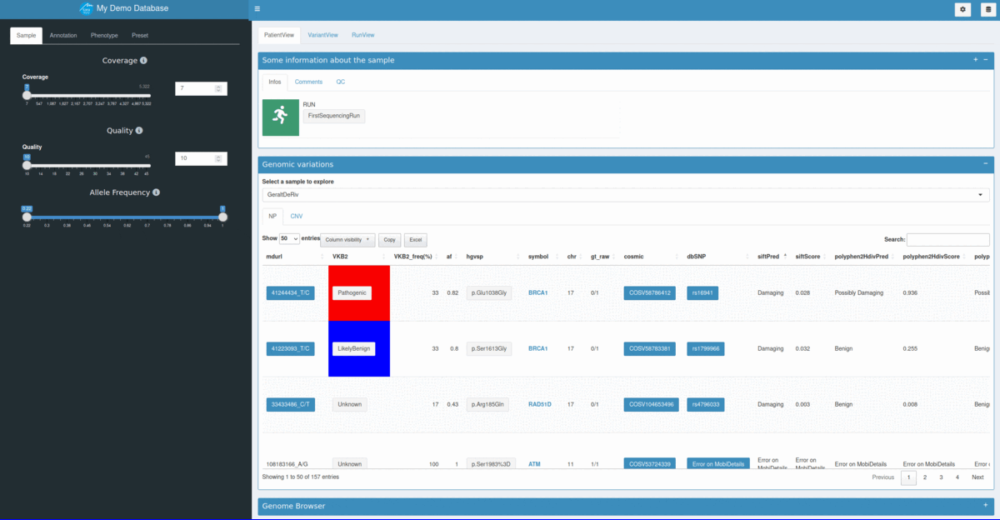

# Requirements

R 4.2.0

# Installation

`devtools::install_github("Plateforme-Data-NGS-CHUGA/GermlineVarDB")`

# Configuration

Save locally and edit the [config file](inst/golem-config.yml)

  - **[Optional]** **browser_server_path** :  In the case of a [local JBrowseR installation](https://gmod.github.io/JBrowseR/articles/creating-urls.html#using-local-data), not intended for production use
  - **[Optional]** **browser_client_url**: Url to your [JBrowseR](https://github.com/GMOD/JBrowseR) server, files should be accessible from the WebBrowser used to access the Shiny app
  - **cache_directory** : directory to store GermlineVarDB cache files in. Necessary for good app performances. If NULL, a temporary directory will be used and cache will be lost on computer restart

# Run the application

`GermlineVarDB::run_app(prefix = "yourdatabasename", db_path = "path_to_your_database_location", config = "path_to_your_config_file")`

For example 

`GermlineVarDB::run_app(prefix = "lung_variations", db_path = "/home/my_databases/", config =  "/home/configs/mycurrentconfir.yml")`

Will launch GermlineVarDB on the following SQLite database : /home/my_databases/lung_variations.db

# Demo app

## Run demo locally

- `GermlineVarDB::run_demo_app(browser = TRUE)` Will download genome reference file on first call before to start the app

- `GermlineVarDB::run_demo_app()` Skip references download and disable genome browser on demo app

## Live demo App

<a href="https://omicsverse.fr/app/GermlineVarDB" target="_blank">See live demo</a>

# Manage your genomic variations database

The GermlineVarDB package comes with a tools suite to manage your database. Here are the more common R functions : 

- `GermlineVarDB::buildDB_seqone(prefix = prefix, db_path = db_path, vcf_name = "pathtovcf")` Will import genomic variations found on the specified vcf (seqone format) to the selected database. [More information abouth the vcf specifications](inst/extdata/testdata/README.md)

- `GermlineVarDB::addMDtodb(db_path = db_path, prefix = prefix, API_key = "MD_API_key", workers = 2)` Will annotate variants in the selected database. A [Mobidetails](https://mobidetails.iurc.montp.inserm.fr/MD) account is required
  
- `GermlineVarDB::addSampleAttributes(db_path = db_path, prefix = prefix, matches_file = system.file("extdata","testdata/samples_run_match.tsv", package = "GermlineVarDB"))` Add samples attributes to the selected databases. [These attributes should be defined in a tsv file ](inst/extdata/testdata/samples_run_match.tsv)

- `GermlineVarDB::compute_frequency(db_path = db_path, prefix = prefix ,attribute = "run")` Compute genomic variant frequencies accoding to a specific samples attribute. Previous Example : According to sample sequencing run belonging.

- `GermlineVarDB::CNVtodb_seqone(db_path = db_path, prefix = prefix, cnvfile_path = system.file("extdata","testdata/cnv.tsv", package = "GermlineVarDB"))` Will import copy number variations found on the specified cnv file [(seqone format)](inst/extdata/testdata/cnv.tsv) to the selected database. 

- `GermlineVarDB::QCtodb_seqone(db_path = db_path, prefix = prefix, qcfile_path = system.file("extdata","testdata/QCs.csv", package = "GermlineVarDB"))` Will import copy number variations found on the specified [QCs file](inst/extdata/testdata/QCs.tsv) to the selected database. 

# Incoming features

- Feed database with vcf produced by [sarek nf core pipeline](https://nf-co.re/sarek/3.2.3)
- Possibility for the user to save filters and parameters presets and choose a default one 
- Add in silico panel lists usable as filtering option
- Possibility for the user to upload a list of preferential transcripts, default use the canonical one in sample variants table -> cleaner view

# Troubleshouting

